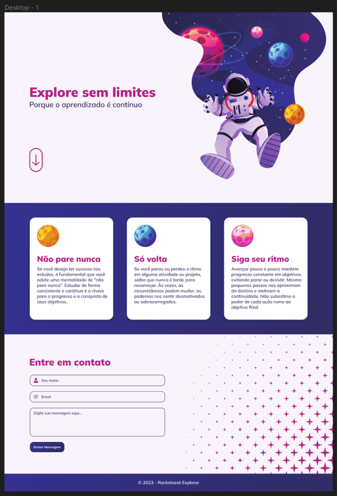

<h1 align="center"> Desafio Explore sem limites 👩🏻‍🚀</h1>

Chegou o momento de colocar a mão na massa e se desafiar com código!  
Bora ver o que te espera por aí? 👀  
 
Preparamos pra você um desafio que envolve o máximo de conteúdo visto nos stages iniciais.  
Como dito anteriormente, passando pelo quiz e conseguindo reproduzir esse layout, sem grandes dificuldades, você já estará apto para **pular direto para o Stage 05**!   
Woooow! Que demais, hein? 💙  
 
A ideia aqui é você recriar esse <a href="https://www.figma.com/file/ExXuvjwWrt9FdR6T2MfdGm/Explore-sem-limites-(Copy)?type=design&node-id=158-677&mode=design&t=0E3wb2yz3aoii40j-0">Link</a> mas, diferente dos desafios iniciais que possuem apenas uma tela, esse tem mais de uma seção…

  <a href="#-tecnologias">Tecnologias</a>&nbsp;&nbsp;&nbsp;|&nbsp;&nbsp;&nbsp;  
  <a href="#-dicas">Dicas</a>&nbsp;&nbsp;&nbsp;

 

  

## 🚀 Tecnologias

Esse projeto foi desenvolvido com as seguintes tecnologias:

- HTML e CSS
- JavaScript
- Git e Github
- Figma

## 🔖 Dicas

 
  Pontos importantes e que devem ser pensados durante a construção do projeto:   

<ul>
  <li>
    Inicie o seu projeto levando em consideração a regra do mobile first, como você pode ver, no layout já temos a aplicação responsiva também;
</li>

<li>
    Você pode adicionar animações, transições e transformações a seu critério;
</li>
<li>
    Seria bacana se já iniciasse o projeto usando as unidades de medida flexíveis (rem);
</li>
<li>
    Você pode usar variáveis no CSS pra treinar;
</li>
<li>
    Olhe com carinho para a acessibilidade: cuide da semântica do seu HTML.
</li>    
</ul>

Feito com ♥ by Rocketseat :wave: [Participe da nossa comunidade!](https://discord.gg/rocketseat)

